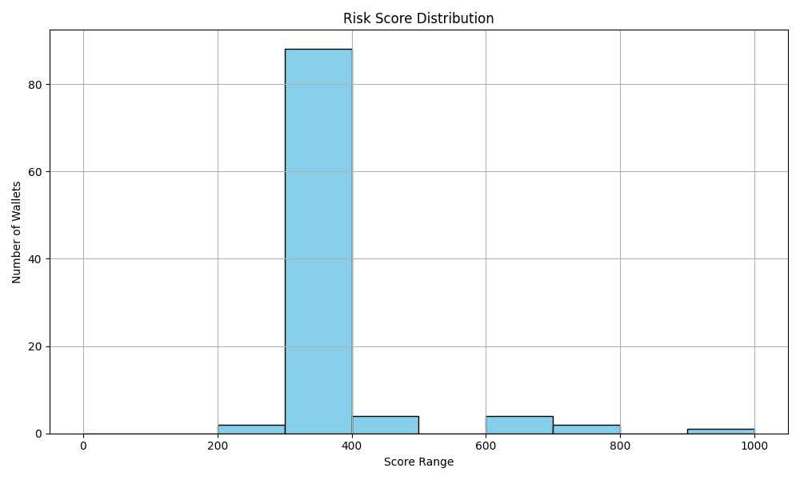

# 📊 Compound Wallet Risk Analysis

## 🔢 Score Distribution:

| Score Range | Wallets | Risk Interpretation |
|-------------|---------|----------------------|
| 0-100 | 0 | 🚨 Extremely high-risk: very low interaction or unhealthy usage |
| 100-200 | 0 | ⚠️ High-risk: rare repays, or suspicious interactions |
| 200-400 | 90 | 🟠 Mid risk: low diversity, uncertain patterns |
| 400-600 | 4 | 🟡 Moderate: some diversity, not highly active |
| 600-800 | 6 | 🟢 Low risk: reliable, decent behavior |
| 800-1000 | 1 | ✅ Very reliable: active, consistent repay, no signs of exploit |
